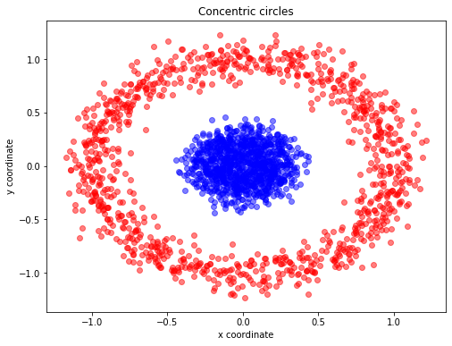
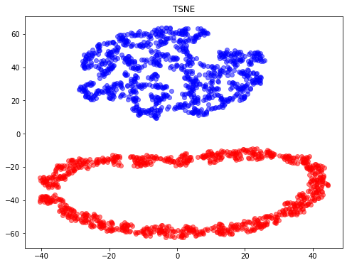
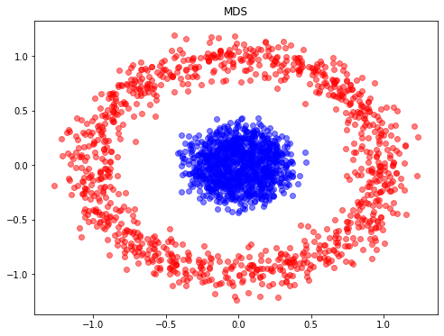
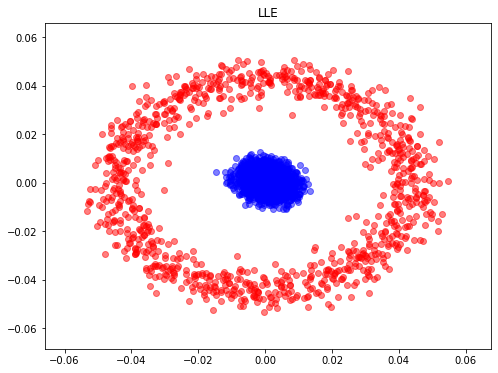
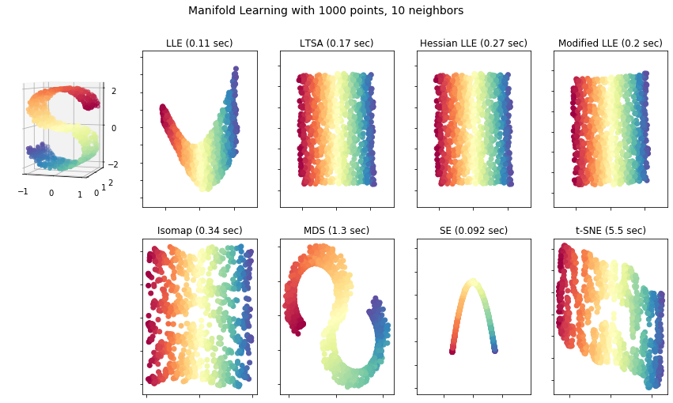

# STA 141C Big-data and Statistical Computing

## Discussion 5: Non-linear Dimensionality Reduction - Manifold Learning

TA: Tesi Xiao

### Clustering vs Dimensionality Reduction

- clustering is generally done to reveal the underlying cluster structure of the data.
- dimensionality reduction is often motivated mostly by computational concerns (fewer variables) or visualization purposes (2D or 3D).

### Manifold Learning

[Reference](https://scikit-learn.org/stable/modules/manifold.html)

- **Multi-dimensional Scaling** (MDS): seeks a low-dimensional representation of the data in which the distances respect well **the distances in the original high-dimensional space**.
- **Isomap** (Isometric Mapping): Isomap seeks a lower-dimensional embedding which maintains [**geodesic distances**](https://en.wikipedia.org/wiki/Geodesic) between **all points**.
- **Locally linear embedding** (LLE) seeks a lower-dimensional projection of the data which preserves distances **within local neighborhoods**.
  + Regularization: Modified LLE, Hessian-based LLE
  + Local tangent space alignment (LTSA): is algorithmically similar enough to LLE. Rather than focusing on preserving neighborhood distances as in LLE, LTSA seeks to characterize **the local geometry at each neighborhood via its tangent space**, and performs a global optimization to align these local tangent spaces to learn the embedding.

- **Spectral Embedding**: finds a low dimensional representation of the data using a spectral decomposition of the graph Laplacian. The graph generated can be considered as a discrete approximation of the low dimensional manifold in the high dimensional space.

- **t-SNE** (TSNE): converts affinities of data points to probabilities. The affinities in the original space are represented by Gaussian joint probabilities and the affinities in the embedded space are represented by Student’s t-distributions. This allows t-SNE to be particularly sensitive to local structure and has a few other advantages over existing techniques:
  + Revealing the structure at many scales on a single map
  + Revealing data that lie in multiple, different, manifolds or clusters
  + Reducing the tendency to crowd points together at the center

### A Example of t-SNE separating data that lie in different clusters


```python
from sklearn.datasets import make_circles
import matplotlib.pyplot as plt
X, y = make_circles(n_samples=2000, random_state=123, noise=0.1, factor=0.2) ## https://scikit-learn.org/stable/modules/generated/sklearn.datasets.make_circles.html

plt.figure(figsize=(8,6))

plt.scatter(X[y==0, 0], X[y==0, 1], color='red', alpha=0.5)
plt.scatter(X[y==1, 0], X[y==1, 1], color='blue', alpha=0.5)
plt.title('Concentric circles')
plt.ylabel('y coordinate')
plt.xlabel('x coordinate')
plt.show()
```





```python
from sklearn.manifold import TSNE
tsne = TSNE(n_components=2, random_state=0)
X_tsne = tsne.fit_transform(X)
```


```python
plt.figure(figsize=(8,6))
plt.scatter(X_tsne[y==0, 0], X_tsne[y==0, 1], color='red', alpha=0.5)
plt.scatter(X_tsne[y==1, 0], X_tsne[y==1, 1], color='blue', alpha=0.5)

plt.title("TSNE")

```


    Text(0.5, 1.0, 'TSNE')





```python
from sklearn.manifold import MDS
from sklearn.metrics import pairwise_distances
model = MDS(n_components=2, dissimilarity='precomputed', random_state=1)
X_MDS = model.fit_transform(pairwise_distances(X))
```


```python
plt.figure(figsize=(8,6))
plt.scatter(X_MDS[y==0, 0], X_MDS[y==0, 1], color='red', alpha=0.5)
plt.scatter(X_MDS[y==1, 0], X_MDS[y==1, 1], color='blue', alpha=0.5)

plt.title("MDS")
```


    Text(0.5, 1.0, 'MDS')





```python
from sklearn.manifold import LocallyLinearEmbedding
model = LocallyLinearEmbedding(n_neighbors=100, n_components=2, method='standard',
                               eigen_solver='dense')
X_LLE = model.fit_transform(X)
```


```python
plt.figure(figsize=(8,6))
plt.scatter(X_LLE[y==0, 0], X_LLE[y==0, 1], color='red', alpha=0.5)
plt.scatter(X_LLE[y==1, 0], X_LLE[y==1, 1], color='blue', alpha=0.5)

plt.title("LLE")

```


    Text(0.5, 1.0, 'LLE')





### A Comparison of Different Manifold Learning Approaches 


```python
# Author: Jake Vanderplas -- <vanderplas@astro.washington.edu>
from collections import OrderedDict
from functools import partial
from time import time

import matplotlib.pyplot as plt
from mpl_toolkits.mplot3d import Axes3D
from matplotlib.ticker import NullFormatter

from sklearn import manifold, datasets

# Next line to silence pyflakes. This import is needed.
Axes3D

n_points = 1000
X, color = datasets.make_s_curve(n_points, random_state=0)
n_neighbors = 10
n_components = 2

# Create figure
fig = plt.figure(figsize=(15, 8))
fig.suptitle("Manifold Learning with %i points, %i neighbors"
             % (1000, n_neighbors), fontsize=14)

# Add 3d scatter plot
ax = fig.add_subplot(251, projection='3d')
ax.scatter(X[:, 0], X[:, 1], X[:, 2], c=color, cmap=plt.cm.Spectral)
ax.view_init(4, -72)

# Set-up manifold methods
LLE = partial(manifold.LocallyLinearEmbedding,
              n_neighbors, n_components, eigen_solver='auto')

methods = OrderedDict()
methods['LLE'] = LLE(method='standard')
methods['LTSA'] = LLE(method='ltsa')
methods['Hessian LLE'] = LLE(method='hessian')
methods['Modified LLE'] = LLE(method='modified')
methods['Isomap'] = manifold.Isomap(n_neighbors, n_components)
methods['MDS'] = manifold.MDS(n_components, max_iter=100, n_init=1)
methods['SE'] = manifold.SpectralEmbedding(n_components=n_components,
                                           n_neighbors=n_neighbors)
methods['t-SNE'] = manifold.TSNE(n_components=n_components, init='pca',
                                 random_state=0)

# Plot results
for i, (label, method) in enumerate(methods.items()):
    t0 = time()
    Y = method.fit_transform(X)
    t1 = time()
    print("%s: %.2g sec" % (label, t1 - t0))
    ax = fig.add_subplot(2, 5, 2 + i + (i > 3))
    ax.scatter(Y[:, 0], Y[:, 1], c=color, cmap=plt.cm.Spectral)
    ax.set_title("%s (%.2g sec)" % (label, t1 - t0))
    ax.xaxis.set_major_formatter(NullFormatter())
    ax.yaxis.set_major_formatter(NullFormatter())
    ax.axis('tight')

plt.show()
```

    LLE: 0.11 sec
    LTSA: 0.17 sec
    Hessian LLE: 0.27 sec
    Modified LLE: 0.2 sec
    Isomap: 0.34 sec
    MDS: 1.3 sec
    SE: 0.092 sec
    t-SNE: 5.5 sec





### HW Related

#### Packge Installer

1. [pip](https://pypi.org/project/pip/): package installer for python (pip vs pip3)
2. [conda](https://docs.conda.io/en/latest/): an open source package management system and environment management system 


#### Amazon Reviews Dataset


```python
import pyreadr
result = pyreadr.read_r('Amazon.Rdata')
# check the objects we get
print(result.keys())
```

    odict_keys(['dat'])


```python
df = result["dat"]
##checking the keys within df
print(df.keys())
text = df.loc[:, "review"]
text
```

    Index(['name', 'review', 'rating'], dtype='object')


    0       My husband and I selected the Diaper "Champ" m...
    1       I have had a diaper genie for almost 4 years s...
    2       We loved this pail at first. The mechanism see...
    3       Bad construction is my main issue. My husband ...
    4       Diaper catches and jams in the well and that i...
                                  ...                        
    1307    Got this for a gift, not too expensive and the...
    1308    Our previous Sony monitor\'s speaker unit was ...
    1309    Don\'t waste your money on cheaper models. The...
    1310    I bought this monitor for my third child.  I h...
    1311    I went ahead and purchased the Sony Baby Call ...
    Name: review, Length: 1312, dtype: category
    Categories (1307, object): [, "Sophie the Giraffe" has tested positive for p..., "This gate expands from 29 to 52".  This is to..., (This is a long review, but if you read the wh..., ..., we are constantly having troubles with getting..., we bought it from amazon and had used it for o..., we bought this swing thinking that it would be..., we love so pie, she is so cute. my baby loves ...]


```python
## set up
import pandas as pd
from nltk.stem.snowball import FrenchStemmer
from sklearn.feature_extraction.text import TfidfVectorizer
from sklearn.feature_extraction.text import CountVectorizer
stemmer = FrenchStemmer()
analyzer = CountVectorizer().build_analyzer()
def stemmed_words(doc): return (stemmer.stem(w) for w in analyzer(doc))
```


```python
## Document Term Matrix generation
vec = CountVectorizer(analyzer=stemmed_words) # remove numbers
X = vec.fit_transform(text)
dtm = pd.DataFrame(X.toarray(), columns=vec.get_feature_names())
print(dtm.shape)
```

    (1312, 5186)


```python
## Tf-idf matrix generation
vectorizer = TfidfVectorizer(token_pattern='[a-z]{3,15}') # remove numbers
Tfidf = vectorizer.fit_transform(text)
Tfidf = pd.DataFrame(Tfidf.toarray(), columns=vectorizer.get_feature_names())
print(Tfidf.shape)
```

    (1312, 5806)


```python
Tfidf.iloc[1,0:100]
```


    ability       0.000000
    able          0.075259
    about         0.000000
    above         0.000000
    absolute      0.000000
                    ...   
    aftermath     0.000000
    afterwards    0.000000
    again         0.000000
    against       0.000000
    age           0.000000
    Name: 1, Length: 100, dtype: float64


```python
dtm.iloc[1,0:100]
```


    00                  0
    000                 0
    08                  0
    09                  0
    10                  0
                       ..
    4oz                 0
    4surpluscitystor    0
    4th                 0
    50                  0
    52                  0
    Name: 1, Length: 100, dtype: int64


```python

```
