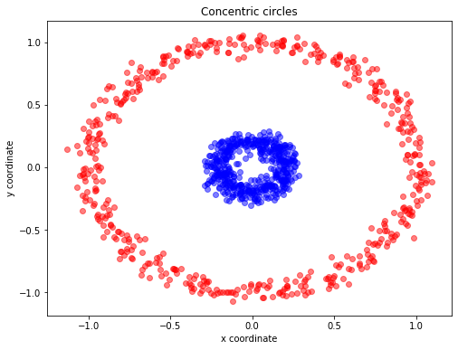
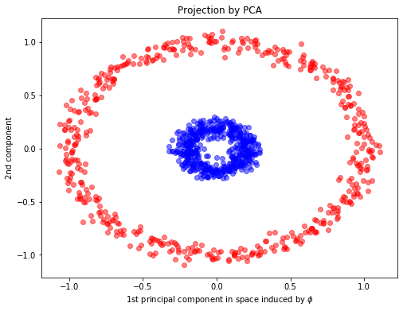
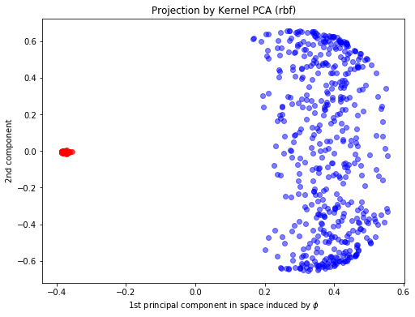
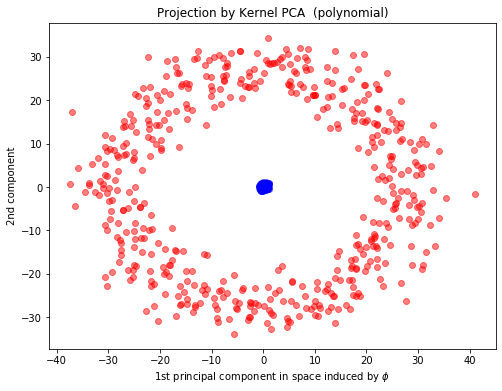
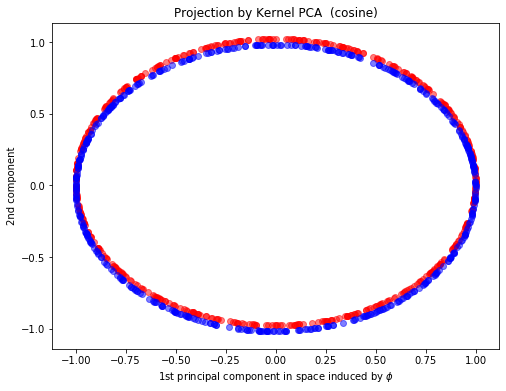
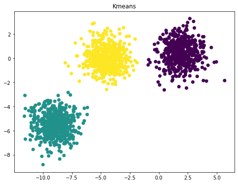
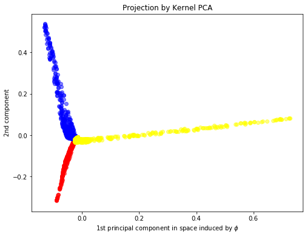

# STA 141C Big-data and Statistical Computing

## Discussion 3: Kernel PCA

TA: Tesi Xiao

PCA is used to decompose a multivariate dataset in a set of successive orthogonal components that explain a maximum amount of the variance by using matrix factorization. Let start with a simple example of concentric circles.


```python
from sklearn.datasets import make_circles
import matplotlib.pyplot as plt

X, y = make_circles(n_samples=1000, random_state=123, noise=0.05, factor=0.2) ## https://scikit-learn.org/stable/modules/generated/sklearn.datasets.make_circles.html

plt.figure(figsize=(8,6))

plt.scatter(X[y==0, 0], X[y==0, 1], color='red', alpha=0.5)
plt.scatter(X[y==1, 0], X[y==1, 1], color='blue', alpha=0.5)
plt.title('Concentric circles')
plt.ylabel('y coordinate')
plt.xlabel('x coordinate')
plt.show()
```





```python
X, y
```


    (array([[-0.08151124,  1.04156863],
            [-0.83407705,  0.55209298],
            [ 0.80292992,  0.49964037],
            ...,
            [ 0.18491366, -0.99335733],
            [-0.13239409, -0.99601977],
            [ 0.06469843,  0.05997449]]),
     array([0, 0, 0, 1, 0, 1, 0, 0, 1, 0, 0, 0, 0, 0, 0, 0, 1, 0, 0, 0, 0, 0,
            0, 1, 1, 1, 1, 0, 1, 0, 1, 0, 1, 0, 1, 1, 0, 0, 0, 1, 1, 0, 1, 0,
            1, 1, 0, 1, 0, 0, 0, 1, 1, 1, 0, 0, 1, 0, 1, 0, 1, 1, 0, 1, 0, 1,
            1, 1, 1, 0, 0, 1, 1, 0, 1, 1, 1, 1, 0, 1, 0, 0, 1, 0, 1, 0, 1, 1,
            0, 0, 1, 1, 1, 0, 0, 1, 1, 1, 1, 1, 1, 1, 1, 1, 1, 1, 0, 1, 1, 0,
            1, 1, 0, 0, 0, 0, 1, 1, 0, 1, 1, 1, 0, 1, 1, 0, 1, 0, 0, 0, 1, 0,
            1, 0, 0, 1, 1, 0, 1, 1, 0, 1, 0, 0, 0, 1, 1, 0, 1, 0, 1, 0, 1, 1,
            0, 1, 0, 0, 0, 1, 0, 1, 0, 0, 0, 0, 1, 0, 0, 0, 1, 1, 1, 1, 1, 0,
            1, 0, 1, 0, 0, 0, 1, 0, 0, 1, 1, 0, 0, 1, 0, 0, 1, 1, 0, 0, 0, 1,
            0, 0, 1, 1, 1, 1, 0, 1, 0, 0, 1, 0, 0, 1, 1, 0, 1, 1, 1, 0, 1, 0,
            1, 1, 0, 1, 0, 1, 0, 1, 1, 0, 0, 1, 0, 1, 0, 0, 0, 1, 0, 0, 1, 1,
            1, 0, 0, 1, 0, 0, 1, 0, 1, 1, 0, 0, 0, 0, 1, 0, 1, 0, 0, 1, 1, 0,
            0, 0, 0, 1, 0, 0, 0, 1, 1, 1, 0, 0, 1, 0, 1, 1, 1, 0, 1, 0, 0, 1,
            0, 1, 1, 1, 1, 1, 1, 1, 0, 1, 1, 0, 1, 0, 0, 0, 0, 0, 0, 1, 0, 0,
            0, 1, 1, 0, 0, 0, 0, 0, 0, 0, 0, 1, 0, 1, 0, 0, 1, 0, 1, 0, 0, 1,
            1, 1, 1, 0, 1, 1, 1, 1, 0, 1, 1, 0, 1, 0, 1, 1, 0, 0, 1, 0, 0, 1,
            1, 0, 0, 0, 1, 0, 0, 1, 0, 0, 0, 1, 1, 0, 1, 0, 1, 0, 0, 0, 0, 1,
            0, 1, 0, 1, 1, 0, 1, 1, 1, 1, 0, 0, 0, 0, 0, 0, 1, 0, 1, 1, 1, 1,
            0, 0, 0, 0, 0, 0, 1, 0, 1, 1, 1, 1, 1, 0, 0, 1, 0, 0, 0, 0, 1, 1,
            0, 0, 1, 0, 1, 1, 0, 0, 0, 1, 1, 1, 1, 1, 0, 0, 1, 0, 1, 1, 0, 0,
            1, 1, 0, 1, 0, 1, 0, 1, 0, 1, 1, 0, 0, 0, 1, 1, 1, 1, 1, 1, 1, 1,
            0, 0, 0, 0, 1, 1, 1, 0, 1, 1, 1, 0, 0, 1, 0, 1, 1, 0, 0, 1, 1, 1,
            0, 1, 0, 1, 0, 0, 1, 1, 1, 0, 0, 1, 0, 0, 1, 0, 1, 1, 0, 0, 0, 0,
            1, 0, 0, 1, 1, 1, 0, 1, 1, 0, 1, 0, 1, 1, 0, 0, 1, 0, 0, 1, 1, 1,
            0, 1, 0, 1, 1, 0, 1, 1, 0, 0, 0, 0, 1, 0, 1, 1, 1, 1, 0, 0, 0, 0,
            0, 1, 1, 0, 0, 1, 1, 1, 1, 1, 0, 1, 1, 0, 1, 1, 1, 0, 1, 1, 0, 1,
            0, 0, 1, 0, 1, 0, 0, 0, 1, 1, 1, 0, 1, 1, 0, 0, 0, 0, 0, 1, 0, 0,
            1, 1, 1, 1, 1, 0, 0, 0, 0, 1, 1, 0, 1, 1, 1, 1, 1, 1, 1, 0, 1, 0,
            0, 1, 1, 1, 0, 1, 0, 1, 0, 1, 1, 1, 1, 0, 1, 0, 0, 0, 1, 1, 1, 0,
            1, 1, 1, 1, 1, 0, 1, 1, 0, 1, 1, 0, 0, 0, 1, 1, 0, 1, 1, 0, 1, 1,
            0, 1, 0, 0, 0, 0, 1, 0, 0, 0, 1, 1, 1, 0, 0, 0, 0, 0, 1, 0, 0, 0,
            1, 1, 1, 1, 0, 1, 1, 0, 1, 0, 1, 0, 1, 0, 1, 0, 0, 0, 0, 0, 1, 1,
            1, 1, 0, 1, 0, 0, 0, 1, 1, 0, 1, 0, 1, 1, 0, 1, 0, 0, 0, 0, 1, 0,
            0, 1, 1, 1, 1, 0, 1, 0, 1, 1, 1, 1, 1, 1, 1, 0, 1, 1, 1, 1, 0, 1,
            1, 0, 0, 0, 1, 0, 1, 0, 1, 1, 1, 0, 0, 1, 0, 0, 1, 0, 1, 1, 1, 1,
            1, 0, 0, 0, 0, 0, 1, 1, 0, 0, 0, 1, 1, 1, 1, 1, 1, 0, 1, 1, 1, 0,
            1, 1, 1, 0, 0, 1, 1, 1, 1, 0, 1, 0, 0, 1, 1, 1, 0, 1, 0, 1, 1, 0,
            1, 0, 1, 0, 0, 1, 1, 1, 0, 1, 0, 0, 0, 1, 0, 1, 0, 0, 0, 0, 0, 1,
            1, 0, 0, 0, 0, 0, 1, 1, 1, 0, 1, 0, 0, 0, 1, 0, 0, 1, 0, 0, 1, 0,
            0, 1, 0, 0, 0, 0, 1, 0, 0, 1, 0, 1, 1, 1, 1, 0, 1, 1, 0, 0, 0, 0,
            0, 0, 0, 0, 0, 1, 0, 0, 0, 0, 1, 0, 1, 0, 0, 1, 0, 0, 0, 1, 1, 0,
            1, 0, 1, 1, 0, 1, 0, 1, 1, 0, 0, 1, 0, 0, 0, 0, 1, 0, 1, 0, 0, 1,
            1, 1, 0, 1, 1, 0, 0, 0, 1, 1, 0, 1, 0, 1, 1, 1, 1, 1, 1, 1, 0, 0,
            1, 1, 0, 1, 0, 0, 1, 0, 0, 1, 0, 0, 1, 1, 1, 1, 1, 0, 0, 0, 0, 1,
            1, 0, 0, 1, 0, 0, 1, 0, 0, 0, 0, 1, 1, 0, 0, 1, 0, 0, 1, 0, 1, 0,
            0, 1, 0, 1, 0, 1, 0, 0, 0, 1]))


For Kernel PCA, we can choose the kernel which is the best to decribe the underlying structure. One can interpret the kernel function as a measure of pairwise distance/similariry.

Below are several commonly used kernels. Also see [user guide](https://scikit-learn.org/stable/modules/metrics.html#metrics).


### Cosine similarity

`cosine_similarity` computes the L2-normalized dot product of vectors.
That is, if $x$ and $y$ are row vectors,
their cosine similarity $k$ is defined as:

$$k(x, y) = \frac{x y^\top}{\|x\| \|y\|}$$

This is called cosine similarity, because Euclidean (L2) normalization
projects the vectors onto the unit sphere,
and their dot product is then the cosine of the angle between the points
denoted by the vectors.


### Linear kernel

The function `linear_kernel` computes the linear kernel, that is, a
special case of `polynomial_kernel` with ``degree=1`` and ``coef0=0`` (homogeneous).
If $x$ and $y$ are column vectors, their linear kernel is:

$$k(x, y) = x^\top y$$

*Remark: Linear Kernel PCA = Standard PCA*


### Polynomial kernel

The function `polynomial_kernel` computes the degree-d polynomial kernel
between two vectors. The polynomial kernel represents the similarity between two
vectors. Conceptually, the polynomial kernels considers not only the similarity
between vectors under the same dimension, but also across dimensions. When used
in machine learning algorithms, this allows to account for feature interaction.

The polynomial kernel is defined as:

$$k(x, y) = (\gamma x^\top y +c_0)^d$$

where:

- $x$, $y$ are the input vectors
- $d$ is the kernel degree

If $c_0 = 0$ the kernel is said to be homogeneous.


### Sigmoid kernel

The function `sigmoid_kernel` computes the sigmoid kernel between two
vectors. The sigmoid kernel is also known as hyperbolic tangent, or Multilayer
Perceptron (because, in the neural network field, it is often used as neuron
activation function). It is defined as:

$$k(x, y) = \tanh( \gamma x^\top y + c_0)$$

where:

- $x$, $y$ are the input vectors
- $\gamma$ is known as slope
- $c_0$ is known as intercept


### RBF kernel

The function `rbf_kernel` computes the radial basis function (RBF) kernel
between two vectors. This kernel is defined as:

$$k(x, y) = \exp( -\gamma \| x-y \|^2)$$

where $x$ and $y$ are the input vectors. If $\gamma = \sigma^{-2}$
the kernel is known as the Gaussian kernel of variance $\sigma^2$.


### Laplacian kernel

The function `laplacian_kernel` is a variant on the radial basis 
function kernel defined as:

$$k(x, y) = \exp( -\gamma \| x-y \|_1)$$

where $x$ and $y$ are the input vectors and $\|x-y\|_1$ is the 
Manhattan distance between the input vectors.


```python
from sklearn.decomposition import PCA, KernelPCA

## PCA fitting
pca = PCA(n_components=2)
X_pca = pca.fit_transform(X)

## Kernel PCA fitting
kpca = KernelPCA(n_components=2,kernel="rbf", fit_inverse_transform=True, gamma=10)
X_kpca = kpca.fit_transform(X)


plt.figure(figsize=(8,6))
plt.scatter(X_pca[y==0, 0], X_pca[y==0, 1], color='red', alpha=0.5)
plt.scatter(X_pca[y==1, 0], X_pca[y==1, 1], color='blue', alpha=0.5)
plt.xlabel(r"1st principal component in space induced by $\phi$")
plt.ylabel("2nd component")
plt.title("Projection by PCA")
```


    Text(0.5, 1.0, 'Projection by PCA')





```python
plt.figure(figsize=(8,6))
plt.scatter(X_kpca[y==0, 0], X_kpca[y==0, 1], color='red', alpha=0.5)
plt.scatter(X_kpca[y==1, 0], X_kpca[y==1, 1], color='blue', alpha=0.5)
plt.xlabel(r"1st principal component in space induced by $\phi$")
plt.ylabel("2nd component")
plt.title("Projection by Kernel PCA (rbf)")
```


    Text(0.5, 1.0, 'Projection by Kernel PCA (rbf)')





```python
kpca_poly = KernelPCA(n_components=2,kernel="poly", fit_inverse_transform=True, gamma=10)
X_kpca_poly = kpca_poly.fit_transform(X)

plt.figure(figsize=(8,6))
plt.scatter(X_kpca_poly[y==0, 0], X_kpca_poly[y==0, 1]+0.02, color='red', alpha=0.5)
plt.scatter(X_kpca_poly[y==1, 0], X_kpca_poly[y==1, 1]-0.02, color='blue', alpha=0.5)
plt.xlabel(r"1st principal component in space induced by $\phi$")
plt.ylabel("2nd component")
plt.title("Projection by Kernel PCA  (polynomial)")

```


    Text(0.5, 1.0, 'Projection by Kernel PCA  (polynomial)')





```python
kpca_cos = KernelPCA(n_components=2,kernel="cosine", fit_inverse_transform=True, gamma=10)
X_kpca_cos = kpca_cos.fit_transform(X)

plt.figure(figsize=(8,6))
plt.scatter(X_kpca_cos[y==0, 0], X_kpca_cos[y==0, 1]+0.02, color='red', alpha=0.5)
plt.scatter(X_kpca_cos[y==1, 0], X_kpca_cos[y==1, 1]-0.02, color='blue', alpha=0.5)
plt.xlabel(r"1st principal component in space induced by $\phi$")
plt.ylabel("2nd component")
plt.title("Projection by Kernel PCA  (cosine)")

```


    Text(0.5, 1.0, 'Projection by Kernel PCA  (cosine)')





Feel free to try different kernels to see the impact brought by kernels.

## An example of K means clustering and RBF Kernel PCA


```python
from sklearn.cluster import KMeans
from sklearn.datasets import make_blobs
```


```python
n_samples = 1500
random_state = 170
X, y = make_blobs(n_samples=n_samples, random_state=random_state)
```


```python
y_pred = KMeans(n_clusters=3, random_state=random_state).fit_predict(X)
plt.figure(figsize=(8,6))
plt.scatter(X[:, 0], X[:, 1], c=y_pred)
plt.title("Kmeans")
```


    Text(0.5, 1.0, 'Kmeans')





```python
kpca = KernelPCA(n_components=2,kernel="rbf", fit_inverse_transform=True, gamma=10)
X_kpca = kpca.fit_transform(X)
plt.figure(figsize=(8,6))
plt.scatter(X_kpca[y==0, 0], X_kpca[y==0, 1], color='red', alpha=0.5)
plt.scatter(X_kpca[y==1, 0], X_kpca[y==1, 1], color='blue', alpha=0.5)
plt.scatter(X_kpca[y==2, 0], X_kpca[y==2, 1], color='yellow', alpha=0.5)
plt.xlabel(r"1st principal component in space induced by $\phi$")
plt.ylabel("2nd component")
plt.title("Projection by Kernel PCA")
```


    Text(0.5, 1.0, 'Projection by Kernel PCA')





RBF kernel describes the affinity within the neighborhood. Thus, RBF Kernal PCA can recover the underlying blob-like clusters by the first two principle components.

## word2vec

A detailed version of using word2vec on real data:
https://github.com/kavgan/nlp-in-practice/blob/master/word2vec/Word2Vec.ipynb
