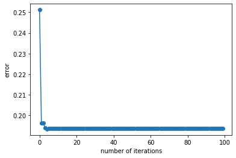

# STA 141C Big-data and Statistical Computing

## Discussion 1: Power Method

TA: Tesi Xiao

Let A be a $d\times d$ matrix such that

 $A = \lambda (vv^\top) + E$

where $E$ is a random matrix with each entry being an i.i.d. standard Gaussian variable, $v$ is some fixed d-densional vector with unit 2-norm. Note that $A$ is a rank-1 matrix perturbed with a random noise matrix $E$. Thus when $\lambda$ is sufficiently large, $(\lambda, v)$ will be the leading eigenvalue and its corresponding eigenvector of $A$. We then can apply the power method to estimate the eigenvector $v$.


```python
import numpy as np
import matplotlib.pyplot as plt

# set a random seed
np.random.seed(2021)
# prespecify the dimension d and the top eigenvalue lambda
d, lam = 10, 10
# generate a random unit vector v
v = np.random.rand(d)
v = v/np.linalg.norm(v)
# Calculate A
A = lam * np.outer(v,v) + np.random.standard_normal((d,d))
```

The function below implements the power method and returns a list containing all the intermediate vectors calculated by power method. 


```python
def power_iteration(A, v0, niter=100):
    """
    A: a d by d matrix, np.array
    v0: a d-dimensional unit vector, np.array
    niter: number of iterations for power method
    """
    vv = []
    for i in range(niter):
        v1 = A @ v0
        v1 = v1/np.linalg.norm(v1)
        vv.append(v1)
        v0 = v1
    return vv
```

We call the above function to run a test and plot the estimation error $\| v_t -v \|_2$ versus the number of iterations. 


```python
v0 = np.ones(d)/np.sqrt(d)
vv = power_iteration(A, v0, 100)
err = [np.linalg.norm(vt - v) for vt in vv]
plt.plot(range(100), err,'-o')
plt.xlabel('number of iterations')
plt.ylabel('error')
```


    Text(0, 0.5, 'error')





Feel free to play around with the above code. You will see, when $\lambda$ is not sufficiently large (for example, $\lambda = 3$), i.e., $\lambda$ and $v$ may not be the largest eigenvalue and eigenvector, the error for power iteration will not converge to 0.
