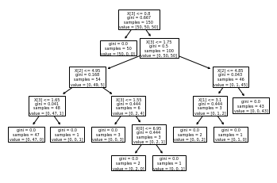

# STA 141C Big-data and Statistical Computing

## Discussion 8: Tree-based Models

TA: Tesi Xiao

### Decision Tree

- Pros
    + Non-linear classifier
    + Nonparametric
    + Better interpretability with splitting nodes
    + Fast prediction

- Cons
    + Overfitting
    + Slow training

[`class sklearn.tree.DecisionTreeClassifier(*, criterion='gini', splitter='best', max_depth=None)`](https://scikit-learn.org/stable/modules/generated/sklearn.tree.DecisionTreeClassifier.html#sklearn.tree.DecisionTreeClassifier)

- Criterion: [Gini impurity](https://en.wikipedia.org/wiki/Decision_tree_learning#Gini_impurity) vs. [Information gain](https://en.wikipedia.org/wiki/Decision_tree_learning#Information_gain)

- [Algorithms](https://scikit-learn.org/stable/modules/tree.html#tree-algorithms-id3-c4-5-c5-0-and-cart)


```python
from sklearn.datasets import load_iris
from sklearn import tree
iris = load_iris()
X, y = iris.data, iris.target
clf = tree.DecisionTreeClassifier()
clf = clf.fit(X, y)
```


```python
tree.plot_tree(clf) # visualize the tree
```


    [Text(167.4, 199.32, 'X[3] <= 0.8\ngini = 0.667\nsamples = 150\nvalue = [50, 50, 50]'),
     Text(141.64615384615385, 163.07999999999998, 'gini = 0.0\nsamples = 50\nvalue = [50, 0, 0]'),
     Text(193.15384615384616, 163.07999999999998, 'X[3] <= 1.75\ngini = 0.5\nsamples = 100\nvalue = [0, 50, 50]'),
     Text(103.01538461538462, 126.83999999999999, 'X[2] <= 4.95\ngini = 0.168\nsamples = 54\nvalue = [0, 49, 5]'),
     Text(51.50769230769231, 90.6, 'X[3] <= 1.65\ngini = 0.041\nsamples = 48\nvalue = [0, 47, 1]'),
     Text(25.753846153846155, 54.359999999999985, 'gini = 0.0\nsamples = 47\nvalue = [0, 47, 0]'),
     Text(77.26153846153846, 54.359999999999985, 'gini = 0.0\nsamples = 1\nvalue = [0, 0, 1]'),
     Text(154.52307692307693, 90.6, 'X[3] <= 1.55\ngini = 0.444\nsamples = 6\nvalue = [0, 2, 4]'),
     Text(128.76923076923077, 54.359999999999985, 'gini = 0.0\nsamples = 3\nvalue = [0, 0, 3]'),
     Text(180.27692307692308, 54.359999999999985, 'X[0] <= 6.95\ngini = 0.444\nsamples = 3\nvalue = [0, 2, 1]'),
     Text(154.52307692307693, 18.119999999999976, 'gini = 0.0\nsamples = 2\nvalue = [0, 2, 0]'),
     Text(206.03076923076924, 18.119999999999976, 'gini = 0.0\nsamples = 1\nvalue = [0, 0, 1]'),
     Text(283.2923076923077, 126.83999999999999, 'X[2] <= 4.85\ngini = 0.043\nsamples = 46\nvalue = [0, 1, 45]'),
     Text(257.53846153846155, 90.6, 'X[1] <= 3.1\ngini = 0.444\nsamples = 3\nvalue = [0, 1, 2]'),
     Text(231.7846153846154, 54.359999999999985, 'gini = 0.0\nsamples = 2\nvalue = [0, 0, 2]'),
     Text(283.2923076923077, 54.359999999999985, 'gini = 0.0\nsamples = 1\nvalue = [0, 1, 0]'),
     Text(309.04615384615386, 90.6, 'gini = 0.0\nsamples = 43\nvalue = [0, 0, 43]')]





### Ensemble Model

(An aggregate of weak learners)

Multiple diverse models are created by using many different modeling algorithms or using different training data sets to predict **one** outcome. The ensemble model aggregates the prediction of each base model and results in once final prediction for the unseen data.


1. **Bagging** (Bootstrap aggregating)

    In the ensemble, each model is created **independently** and votes with equal weight. Bagging trains each model in the ensemble using a **randomly drawn subset** of the training set

    Example: [Random forest](https://scikit-learn.org/stable/modules/generated/sklearn.ensemble.RandomForestClassifier.html?highlight=random%20forest#sklearn.ensemble.RandomForestClassifier) (multiple decision trees)
    
    `class sklearn.ensemble.RandomForestClassifier(n_estimators=100, *, criterion='gini', max_depth=None)`

2. **Boosting**
    
    Boosting involves **incrementally** (sequentially) building an ensemble by training each new model instance to emphasize the training instances that previous models mis-classified.
    
    The new learner learns from the previous weak learners.

    Example: [Gradient Boosted Decision Trees](https://scikit-learn.org/stable/modules/ensemble.html#gradient-tree-boosting) (GBDT)

### Classifier comparison

[link](https://scikit-learn.org/stable/auto_examples/classification/plot_classifier_comparison.html#sphx-glr-auto-examples-classification-plot-classifier-comparison-py)
